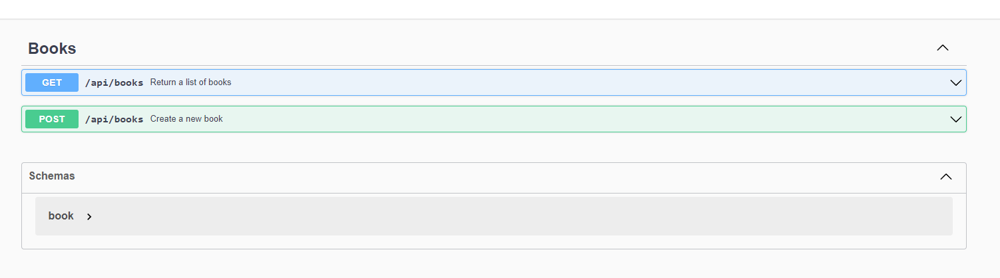

# BookLibraryApi 📚

BookLibraryApi is an API developed in Ruby 3.2.2 and Rails 7.0.8 that serves as a tool for book enthusiasts. In a world where knowledge is power, users can utilize this simple tool to recommend books, create a shared list of recommendations, and search for books based on specific criteria.

## Requirements 📋

- Ruby 3.2.2
- Rails 7.0.8
- sqlite3

Make sure you have Ruby, Rails and sqlite installed on your system before proceeding with the API installation.

## Installation 🚀

Follow the steps below to set up and run the API locally:

1. Clone the repository:

```bash
git clone https://github.com/your-username/BookLibraryApi.git
cd BookLibraryApi
```

2. Install dependencies:

```bash
bundle install
```

3. Run database migrations:

```bash
rails db:setup
```

4. Start the server:

```bash
rails server
```

TThe API will be accessible using Swagger at <http://localhost:3000/api-docs>.


## Usage 📖

## List Recommended Books 📜

Endpoint: `GET /api/books`

This endpoint allows team members to list and recommend books to others. You can also filter the results by providing parameters in the URL:

- `title`: Filter books by title.
- `author`: Filter books by author.
- `genre`: Filter books by genre.

Example query to list all books with the title "Harry Potter":

```bash
GET /api/books?title=Harry%20Potter
```

## Add a Recommended Book 📕

Endpoint: `POST /api/books`

Team members can use this endpoint to add a new recommended book to the shared list. Send the book data in the request body in JSON format.

Example request to add a new recommended book:

```json
{
  "title": "New Book",
  "author": "Unknown Author",
  "genre": "Fiction",
  "publication_year": "2023"
}
```
